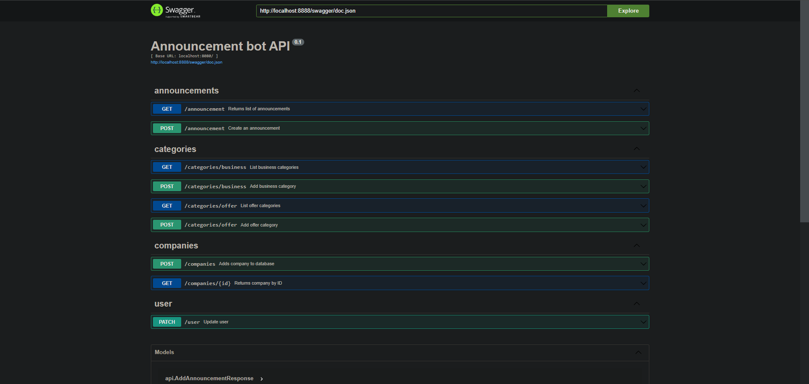

## API Docs
http://localhost:8888/swagger/doc.json

http://localhost:8888/swagger/index.html



## Setup prerequisites
[Telegram Bot](https://core.telegram.org/bots) token is required to interact with [Telegram Bot API](https://core.telegram.org/bots/api). To get one, сreate a bot using [@BotFather](https://t.me/botfather) or follow [Telegram instructions](https://core.telegram.org/bots#how-do-i-create-a-bot).

## Local environment
This repository provides an easy-to-use local development environment. Using it you can start writing your bot business logic without spending time on the environment.

Local environment includes:
- [ngrok](https://ngrok.com/) reverse proxy to server local mini-app and bot deployment over HTTPS
- [nginx](https://www.nginx.com/) reverse proxy to host both API and UI on one ngrok domain and thus fit into the [free plan](https://ngrok.com/pricing)
- React fast refresh to avoid rebuilding docker container on each change of the UI code

Local environment setup:

copy .env from .env.example
```bash
cp .env.example .env && cp .env.example backend/.env
```

Create an account on [ngrok](https://ngrok.com/)

Get a [ngrok auth token](https://ngrok.com/docs/secure-tunnels/ngrok-agent/tunnel-authtokens/) and save it to `NGROK_AUTHTOKEN` variable in `.env` file in the project root directory

Claim a [free ngrok domain](https://ngrok.com/blog-post/free-static-domains-ngrok-users) and save it to `NGROK_DOMAIN` variable in `.env` file in the project root directory

Copy [Telegram Bot token](#setup-prerequisites) and save it to `TELEGRAM_BOT_TOKEN` variable in `.env` file in the project root directory

Install [Docker](https://docs.docker.com/get-docker/)

To start or update the environment with the latest code changes, use:
```sh
docker compose up --build -d
```

After successful deployment, your local bot API will be available at https://ngrok-domain/api. Use this URL to set the bot webhook as described [switching bot environment](#switching-bot-environment).

## Switching bot environment
After the bot is either [launched locally](#local-environment) or [deployed in GCP](#production-deployment), Telegram needs to be configured with a proper webhook URL. To set it, use:
```sh
curl https://api.telegram.org/bot${TELEGRAM_BOT_TOKEN}/setWebhook?url=${BOT_API_URL}/bot
```

## Built with
- [Docker](https://www.docker.com/)
- [Go](https://go.dev/)
- [React](https://react.dev/)
- [Vite](https://vitejs.dev)
- [gotgbot](https://github.com/PaulSonOfLars/gotgbot)
- [nginx](https://www.nginx.com/)
- [ngrok](https://ngrok.com/)